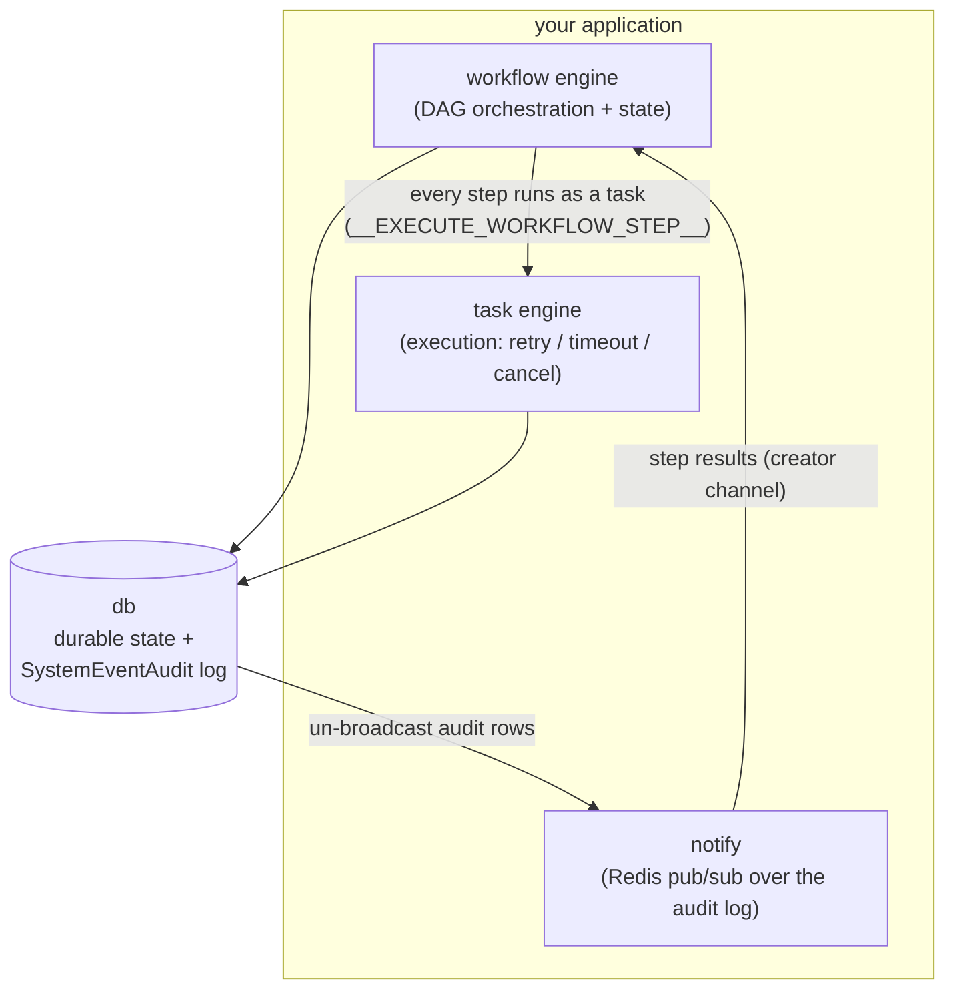

# `tasking` — reliable async tasks & DAG workflows for Go

`tasking` is an **embeddable Go library** for running asynchronous background **tasks** and
multi-step **DAG workflows** reliably — with retries, timeouts, cancellation, and a subscribable
notification stream — surviving process restarts and worker crashes.

It is a library embedded by other applications: it orchestrates execution, but it does **not** own
multi-tenancy or access control — those belong to the embedding application. Each component's
`DESIGN.md` records the rationale for that boundary.

## Use cases

- **Background jobs** — submit a unit of work and have it run reliably: immediate or scheduled
  one-shot, with per-attempt **retry** (exponential backoff), a per-attempt **timeout**, and
  **cancellation**.
- **Multi-step pipelines** — express work as a **DAG** of steps with dependency edges; the engine
  fans out steps that can run in parallel, dispatches each step once its parents finish, enforces a
  workflow-wide deadline, and lets you **revive** a failed workflow or **cancel** one (e.g.
  `render → thumbnail → publish`).
- **Reacting to state changes** — subscribe to task/workflow lifecycle events over Redis pub/sub.

**Intentionally out of scope** (belongs to the embedding application): multi-tenancy isolation,
and access control. Periodic/recurring tasks are also not yet supported
(only immediate and scheduled one-shot). See each component's `DESIGN.md`.

## How the pieces fit



The **workflow engine** owns DAG orchestration and state; the **task engine** owns the execution of
each individual step — per-attempt retry and timeout are the task engine's job. Every workflow step,
whatever its type, is executed as an ordinary task under the reserved name
`__EXECUTE_WORKFLOW_STEP__`, so the workflow engine inherits the task engine's reliability for free.
Both engines write durable, creator-tagged `SystemEventAudit` rows in the **same transaction** as
each state change; **`notify`** turns those rows into a best-effort Redis pub/sub stream — and the
workflow scheduler is itself a `notify` subscriber, which is how step results reach it.

**Shared reliability model.** Across all three components, the **database is the source of truth**.
Every IPC message is a best-effort *poke* that lets a component act sooner than its periodic
maintenance sweep would; lose a poke and work is **delayed, never lost**. IPC rides crash-safe
reliable Redis queues, handlers are idempotent, and unprocessable messages are quarantined rather
than crash-looped.

## Components

| Component                    | Purpose                                                          | Docs |
| ---------------------------- | ---------------------------------------------------------------- | ---- |
| **Task Engine** (`task`)     | Reliable async execution of a single unit of work               | [README](task/README.md) · [DESIGN](task/DESIGN.md) |
| **Workflow Engine** (`workflow`) | DAG orchestration of multi-step workflows over the task engine | [README](workflow/README.md) · [DESIGN](workflow/DESIGN.md) |
| **Notifications** (`notify`) | Best-effort Redis pub/sub stream over the durable audit log      | [README](notify/README.md) · [DESIGN](notify/DESIGN.md) |

Underpinning all three: the **`db`** package (`db.Client` and transaction support — persistence and
the `SystemEventAudit` log) and the **`models`** package (configuration structs, wire types, and the
engine's state enums).

## Wiring it together

A single embedding application typically stands up all three components. The snippet below elides
error handling (`// ...`) and full parameter sets — see each component's README for those — to keep
the **composition** in focus. The composition point to notice is that a workflow's Step Runner is
handed to the **task engine** as the processor for the reserved task name `__EXECUTE_WORKFLOW_STEP__`,
right alongside your ordinary task processors. Processors are supplied **declaratively** at
construction — a per-queue `task name → processor` mapping — so there is no runtime registration
call: the receiver hands each queue's map to that queue's executor.

```go
// --- Step Runner: one processor that runs any workflow step by dispatching on Type ---
runner, _ := workflow.NewRunWorkflowStepTaskProcessor(dbClient, map[string]models.WorkflowStepProcessor{
    "render-html":     renderHandler{},
    "make-thumbnails": thumbnailHandler{},
    "push-cdn":        cdnHandler{},
})

// --- Processors: per-queue (queue name → (task name → processor)). This is where workflow plugs
//     into task — the Step Runner is just the processor for the reserved workflow task name, sitting
//     alongside ordinary task processors on whichever queue serves them. ---
processors := map[string]map[string]models.TaskExecutionProcessor{
    "default-queue": {
        "resize-image":                    resizeProcessor{},
        models.WorkflowExecutionTaskName: runner, // "__EXECUTE_WORKFLOW_STEP__"
    },
}

// --- Task Receiver: its ExecutorFactory just forwards the per-queue processor map to NewExecutor ---
executorFactory := func(
    parentCtx context.Context, queue string, workers, bufLen int,
    support task.ExecutorSupport, queueProcessors map[string]models.TaskExecutionProcessor,
) (task.Executor, error) {
    return task.NewExecutor(parentCtx, queue, workers, bufLen, support, queueProcessors)
}

receiver, _ := task.NewReceiver(ctx, task.NewReceiverParams{
    Support:            task.ExecutorSupport{Persistence: dbClient}, // OnCompleteCB is set by the receiver
    Config:             receiverConfig, // models.TaskReceiverConfig — must configure "default-queue"
    ExecutorFactory:    executorFactory,
    Processors:         processors, // every key must be a configured queue
    Redis:              redisClient,
    IPCReceiverFactory: common.NewRedisIPCMessageReceive,
    IPCSenderFactory:   common.NewRedisIPCMessageSend,
})
_ = receiver.Initialize(ctx, nil) // MUST run before Start: reconciles buffered work after a crash
_ = receiver.Start(ctx)
defer receiver.Stop(ctx)

// --- Task Scheduler: the single writer of task state ---
taskScheduler, _ := task.NewScheduler(ctx, task.NewSchedulerParams{
    Persistence:        dbClient,
    Config:             taskSchedulerConfig, // models.TaskSchedulerConfig — route __EXECUTE_WORKFLOW_STEP__ to a queue here
    Redis:              redisClient,
    IPCReceiverFactory: common.NewRedisIPCMessageReceive,
    IPCSenderFactory:   common.NewRedisIPCMessageSend,
})
_ = taskScheduler.Start(ctx)
defer taskScheduler.Stop(ctx)

// --- notify Producer: broadcasts audit rows. EmitCreator:true is REQUIRED for workflow feedback ---
producer, _ := notify.NewProducer(ctx, notify.NewProducerParams{
    Persistence: dbClient,
    Redis:       redisClient,
    Config: models.NotificationProducerConfig{
        PollIntervalSecs: 5,
        BatchSize:        100,
        EmitCreator:      true, // hard requirement: the workflow scheduler's feedback fast path
    },                          // subscribes on notify:creator:<engine-creator>; without this every
})                             // step outcome is silently delayed by up to one maintenance interval.
_ = producer.Start(ctx)
defer producer.Stop(ctx)

// --- Task Client: workflow steps are dispatched THROUGH this ---
taskClient, _ := task.NewClient(ctx, task.NewClientParams{
    Name: "my-app", DefaultCreator: "my-app",
    Persistence: dbClient, Config: taskClientConfig, Redis: redisClient,
    IPCSenderFactory: common.NewRedisIPCMessageSend,
})

// --- Workflow Scheduler: single writer of workflow state; dispatches steps via the task client,
//     receives their results via a notify Consumer ---
wfScheduler, _ := workflow.NewWorkflowScheduler(ctx, workflow.NewWorkflowSchedulerParams{
    Persistence:           dbClient,
    TaskClient:            taskClient,
    Config:                wfSchedulerConfig, // models.WorkflowSchedulerConfig
    Redis:                 redisClient,
    IPCReceiverFactory:    common.NewRedisIPCMessageReceive,
    IPCSenderFactory:      common.NewRedisIPCMessageSend,
    NotifyConsumerFactory: notify.NewConsumer,
})
_ = wfScheduler.Start(ctx)
defer wfScheduler.Stop(ctx)

// --- Submit work ---
wfClient, _ := workflow.NewClient(ctx, workflow.NewClientParams{
    Name: "my-app", DefaultCreator: "my-app",
    Persistence: dbClient, Config: wfClientConfig, Redis: redisClient,
    IPCSenderFactory: common.NewRedisIPCMessageSend,
    KnownStepTypes:   map[string]bool{"render-html": true, "make-thumbnails": true, "push-cdn": true},
})
wf, _ := wfClient.DefineAndRunWorkflow(ctx, workflow.DefineWorkflowParams{ /* ... */ }, nil)
_ = wf
```

**Routing.** Because a workflow step is an ordinary task, route `models.WorkflowExecutionTaskName`
(`__EXECUTE_WORKFLOW_STEP__`) to a task execution queue in your `TaskSchedulerConfig` task-name →
queue mapping, and have a receiver serve that queue — exactly as for any other task. See
[task/README.md](task/README.md) and [workflow/README.md](workflow/README.md) for the full flow.

## Requirements & getting started

- **Module:** `github.com/alwitt/tasking` (Go 1.26+).
- **PostgreSQL-compatible database** — durable state and the `SystemEventAudit` log, via the `db`
  package.
- **Redis** — IPC message queues (engine coordination) and pub/sub (notifications).

Build and test targets live in the [`Makefile`](Makefile).

## License

Released under the [MIT License](LICENSE).
